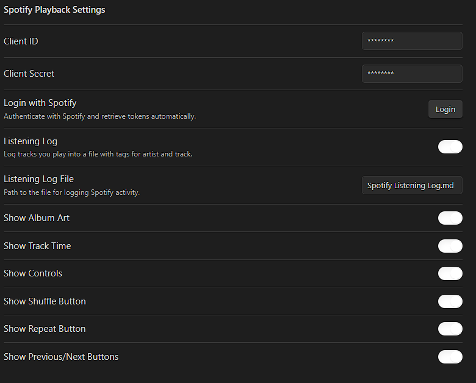

# Spotify-Playback
Allow for Spotify to be played back through Obsidian. 

**This Plugin requires a Spotify Premium and Developer account**

Spotify Playback Features
 * Track title & artist(s)
   * Album art (toggleable in settings)
   * Real-time progress bar & time counter (updates every second while playing)
   * Playback controls: Play/Pause, Next, Previous, Shuffle, Repeat
* Live Sync with Spotify state:
   * Buttons (Play/Pause, Shuffle, Repeat) update to reflect Spotify’s actual state after each interaction.
   * State refreshes automatically every 5 seconds.
   - Internal Server for Token requests
        - There is now a button for token resets
   - Updated Callback links and requirements
   - Listening Log
       * Persistent listening log stored in a single Markdown file.
       * Track and Artist(s) are also present with tags, to allow for search.
         ** Side Note: The Listening Log is editable for manual input.

Future Features
- Different Themes for Dark / Light. 
- Better UI
- Search for different categories.

# Instructions
    Create a Spotify Developer Account [[https://developer.spotify.com/dashboard]]
     - Create App
     Follow steps to fill in your basic Information. 
      - Set your Redirect URI to http://127.0.0.1:8888/callback
      - API's Used
        - Web API
        - Web Playback SDK
    You will need the Client ID and Client Secret when trying to connect your Spotify to Obsidian.

## Open your plugins folder
- Drag and drop the plugin into your plugins folder.
- Enable it in the Community Plugins Settings
- Copy over your Client ID and Client Secret [Remember to keep these hidden]
    - The plugin masks the string of digits for some privacy.

Open your terminal and search for Spotify Playback: Login to Spotify
- This will open up your browser and ask for permission to sync to Spotify
- Choose Obsidian as your application to open. [You do not need to click the Always Use option.]
- Once connected open your terminal and search for Spotify Playback: Open Now Playing Sidebar.
- This will allow for the plugin to be placed on either sidebar for viewing.
- You can also use hotkeys and terminal commands to play spotify tracks.

If you are playing something spotify it will show up. If not open spotify and select a playlist or album. You should be able to play Audiobooks and Podcasts as well.

If you have any questions, or requests please message me on GitHub.

# FAQ
- How often are updates?
    - Mostly they'll be posted through the week, as I work long hours on the weekend. Each update will probably have a test phase before I push it to the live branch. 
- How often does this API refresh?
    - Spotify limits the refresh to 1 hour. This app automatically refreshes the token needed.
